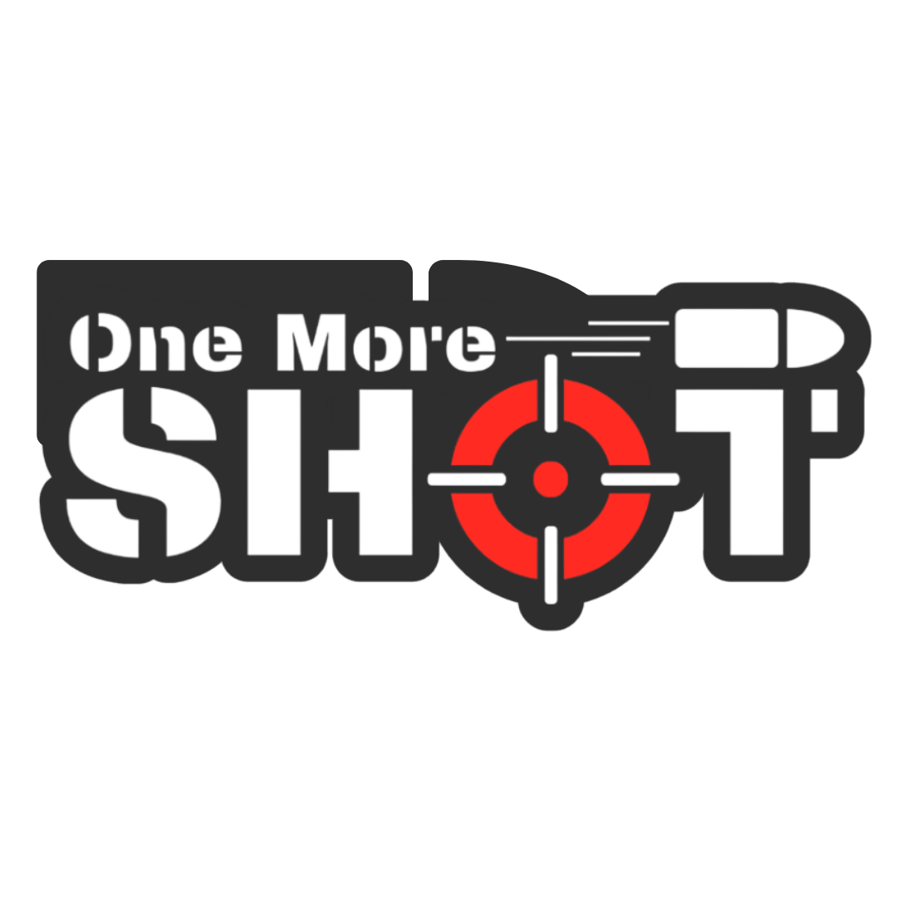
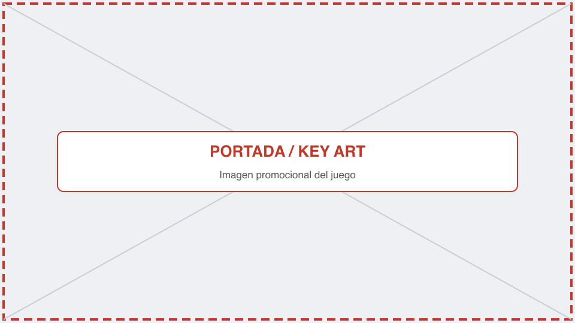
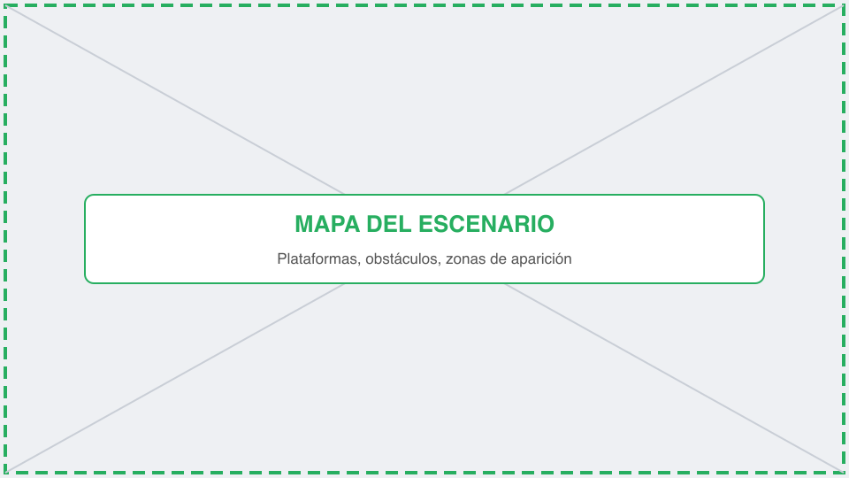

# JuegosEnRed-GrupoC
Repositorio del Grupo C: Hugo Rivera, Jesús Mañas y Alejandro Del Campo

  

# One More Shot

**Juegos en Red · Grado en Diseño y Desarrollo de Videojuegos · URJC · Curso 2026/27** 
**Grupo C**

## Descripción de la temática

One More Shot es un shooter en PixelArt 2D para dos jugadores en red en el amb. Ambientado en AAA, los jugadores deben AAA AAA AAA para AAA AAA.

## Equipo de desarrollo

| Nombre y apellidos | Correo URJC | GitHub |
| Alejandro Del Campo | a.delcampom.2024@alumnos.urjc.es | `@alejandrodcm04-27` |
| Hugo Rivera | h.rivera.2024@alumnos.urjc.es | `@Forni8` |
| Jesús Mañas | j.manas.2024@alumnos.urjc.es | `@whitelyon21` |

**Repositorio:** `https://github.com/alejandrodcm04-27/JuegosEnRed-GrupoC`

**Licencia:** [Apache 2.0](LICENSE)

---

## 1. Introducción

### 1.1. Concepto del juego

One More Shot es un juego de acción arcade multijugador en 2D (PvP) en el que cada jugador es un personaje pixelart con un arma de fuego. La idea principal son combates rápidos y directos en un escenario cerrado (se ve completo en pantalla), donde los jugadores cuentan con tres vidas y un arsenal de potenciadores (power-ups) y elementos interactivos para eliminar a su rival.

### 1.2. Propuesta de valor

¿Qué hace diferente a One More Shot? El juego apuesta por la accesibilidad de controles simples combinada con un alto componente de imprevisibilidad y caos en la arena de combate. 

- **Interactividad letal:** Uso del entorno para atacar, como disparar a garrafas de gasolina que provocan explosiones de área.
- **Armamento dinámico:** Sistema de *power-ups* aleatorios que alteran drásticamente el flujo del combate (hipervelocidad, instakill, ráfagas...).
- **Riesgo y recompensa:** Las explosiones ambientales y ciertos modificadores pueden dañar tanto al enemigo como al jugador que los detona.

*Figura 1. Imagen promocional de One More Shot.*

---

## 2. Especificaciones básicas

| Aspecto | Descripción |
| **Título** | One More Shot |
| **Género** | Arena Shooter / Acción Arcade PvP |
| **Número de jugadores** | 2 (en red/local, tiempo real) |
| **Público objetivo** | Jugadores casuales de 12 a 30 años |
| **Clasificación PEGI** | PEGI 12 (Violencia no realista) |
| **Plataforma** | Navegador web (PC) |
| **Duración de una partida** | 2-3 minutos |
| **Representación** | 2D |
| **Licencia** | Apache 2.0 |

---

## 3. Jugabilidad

### 3.1. Objetivo del juego

El objetivo de cada jugador es eliminar al oponente utilizando armas de fuego, elementos del entorno y ayudarse de potenciadores. Cada jugador comienza con un contador de 3 vidas. La partida termina cuando uno de los dos pierde todas sus vidas. Gana el jugador que quede en pie.

### 3.2. Controles

| Acción | Jugador 1 | Jugador 2 |
| Moverse a la izquierda | `A` | `←` |
| Moverse a la derecha | `D` | `→` |
| Saltar | `W` | `↑` |
| Bajar de plataforma | `S` | `↓` |
| Apuntar | `W``A``S``D` | `↑``←``↓``→` |
| Poner Mina | `Q` | `-` |
| Activar Mina (solo tras ponerla) | `Q` | `-` |
| Disparar | Espacio | Enter |
| Pausa | `Esc` | `Esc` |

### 3.3. Mecánicas

#### 3.3.1. Mecánicas principales

- **Movimiento y Plataformas:** Los personajes pueden moverse lateralmente y saltar para navegar por el nivel y sus distintas alturas del escenario cerrado.
- **Disparo direccional:** Los jugadores apuntan y disparan en la misma direccion hacia la que se están moviendo, utilizando las teclas de dirección (`W``A``S``D` para el Jugador 1 y las flechas para el Jugador 2).- **Interacción con el entorno:** Disparar a elementos explosivos del mapa (como barriles o garrafas de gasolina) activa una onda expansiva que causa daño en área. El daño es neutral y afecta tanto a enemigos como al propio jugador si está dentro del radio.

#### 3.3.2. Objetos y potenciadores

| Objeto | Efecto | Duración | Aparición |
| **Minas** | Crea una explosión de radio pequeño. La puede activar el jugador que la pone o por contacto. | Indefinida | 3 por jugador por partida |
| **Impulso de Velocidad** | Aumenta significativamente la velocidad de movimiento del personaje. | 8 s | Aleatoria |
| **Muerte instantanea** | Las balas matan de un solo impacto | 1 disparo | Aleatoria |
| **Fuego Rápido** | Disminuye el tiempo  entre disparos. | 5 s | Aleatoria |
| **Chaleco AntiBalas** | Te vuelves immune al daño de los disparos (pero no explosivos). | 5 s | Aleatoria |
| **Lanzacohetes** | Disparas proyectiles explosivos. | 2 disparos | Aleatoria |

#### 3.3.3. Sistema de puntuación y vidas

Cada jugador posee **3 vidas** representadas en el HUD. Un impacto directo con daño letal resta una vida (salvo uso de potenciadores varios). La condición de victoria es ser el último superviviente.

### 3.4. Físicas y dificultad

- **Gravedad y salto:** Movimiento rapido y responsivo. Con el salto se puede subir a los niveles superiores.
- **Colisiones de proyectiles:** Las balas colisionan y se destruyen al impactar con paredes, plataformas o jugadores.
- **Ondas expansivas:** Sistema de físicas para las garrafas de gasolina. Empujan a los personajes y restan daño si un jugador se encuentra dentro del radio de explosion.
- **Plataformas y plataformas móviles:** Las plataformas se pueden atravesar apretando el boton de movimiento hacia abajo y algunas de ellas estaran dotadas de movimiento.

### 3.5. Escenario

El escenario representa un entorno cerrado tipo "arena", visible en su totalidad sin *scroll* de cámara (single-screen). Se compone de plataformas ubicadas a diferentes alturas para fomentar el movimiento vertical.

*Figura 2. Mapa del escenario con zonas de aparición, plataformas y obstáculos.*